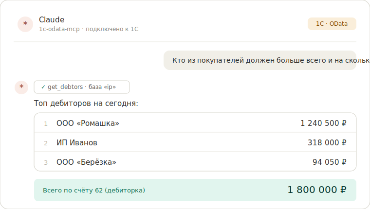

# 1c-odata-mcp — подключение 1С:Предприятие к ИИ (Claude) через OData

[](https://www.npmjs.com/package/1c-odata-mcp)
[](https://github.com/evilbruce666/1c-odata-mcp/actions/workflows/ci.yml)
[](LICENSE)
[](https://nodejs.org)

<p align="center">
  
</p>

> 🇬🇧 **In short:** an MCP server that connects 1C:Enterprise to Claude over its standard OData interface. Ask your accounting database in plain language (debtors, sales, taxes, cash flow) and get the number back; opt-in, preview-gated write. Read-only by default. Run with `npx -y 1c-odata-mcp`. Works with any 1C where OData is published — cloud, SQL or local file base.

**MCP-сервер (Model Context Protocol) для 1С:Предприятие через стандартный интерфейс OData.** Позволяет работать с данными 1С на естественном языке прямо из ИИ-ассистента **Claude** (и любого MCP-клиента): спрашивать про контрагентов, документы, остатки, дебиторку, продажи и движение денег — а при явном включении ещё и создавать/изменять справочники и документы, проводить, регистрировать оплаты.

Если вы искали, **как подключить 1С к нейросети / ИИ**, готовый **коннектор 1С OData** или **интеграцию 1С с Claude** без программирования на стороне 1С — это оно.

- 🔌 Любой **MCP-клиент**: Claude Desktop и Claude Code, Cursor, VS Code (Continue/Cline), JetBrains — и **локальные модели** (Ollama, LM Studio)
- 🔐 **Данные остаются у вас** — сервер это локальный процесс, ходит только в вашу базу; с локальной моделью данные вообще не покидают сеть
- 🏢 Несколько информационных баз и организаций (юрлиц) одновременно
- 🔒 **Только на чтение по умолчанию**; запись — через двойной предохранитель и предпросмотр
- 🚀 Запуск одной командой: `npx -y 1c-odata-mcp`
- ⚙️ Ничего не ставится на стороне 1С — достаточно опубликованного **OData** (без COM-соединения, без доступа к SQL)

> **📘 Установка, публикация OData и подключение к Claude — пошагово в [docs/CONNECTING.md](docs/CONNECTING.md).** Здесь — про сам проект, возможности и ограничения.

---

## Подойдёт под любой ваш вариант 1С

Коннектор общается с 1С **только через OData**. Если он включён — всё работает одинаково, **как бы ни была развёрнута ваша база**:

| Ваша 1С | Что нужно, чтобы заработало | Сложность |
|---|---|---|
| **Облако / хостинг** (Scloud, 1cFresh, аренда 1С) | OData включает провайдер — галочкой в кабинете или по заявке | 🟢 низкая |
| **Сервер с SQL** (PostgreSQL / MS SQL) | опубликовать базу на Apache/IIS + включить OData | 🟡 средняя |
| **Локальная файловая база** (`.1CD`) | то же + выдать веб-серверу права на папку базы | 🟡 средняя |
| **Нет веб-сервера / доступа к конфигуратору** | OData недоступен → нужен другой транспорт | 🔴 |

Тип хранилища (файловая или SQL) сам по себе сложность **не меняет** — важно лишь, поднята ли веб-публикация OData. **Без включённого OData коннектор работать не может** (он не использует COM и не лезет в SQL напрямую).

➡️ Пошаговая инструкция под каждый вариант — в **[docs/ODATA-SETUP.md](docs/ODATA-SETUP.md)**. Адрес базы, учётка и подключение к Claude — в **[docs/CONNECTING.md](docs/CONNECTING.md)**.

---

## Зачем это нужно

Сырой OData 1С — это сотни технических `EntitySet` с кириллическими именами (`Catalog_Контрагенты`, `Document_РеализацияТоваровУслуг`, `AccumulationRegister_ТоварыНаСкладах`) и GUID-ключами. Работать с этим из чата невозможно, а писать свой код под каждый отчёт долго.

Сервер прячет всю технику за понятными инструментами. Вы спрашиваете обычным языком — ИИ сам выбирает нужный инструмент, ходит в OData вашей базы и возвращает готовый ответ. Для руководителя — быстрый срез по бизнесу, для бухгалтера — рутина создания документов под контролем.

---

## Возможности

**Аналитика и чтение (по умолчанию):**

- «Покажи дебиторку» → сальдо счёта 62 по контрагентам
- «История по контрагенту Ромашка» → все документы и взаиморасчёты
- «Остатки на складе» → количество и сумма по номенклатуре
- «Продажи за май», «движение денег за квартал» → обороты за период
- поиск контрагентов и документов, карточки объектов, карта базы

**Действия (при включённой записи, всегда с предпросмотром и подтверждением):**

- «Заведи контрагента ООО Ромашка, ИНН …, телефон, email, расчётный счёт, директора»
- «Выстави счёт покупателю на 3 шт по 1000» → документ-черновик
- «Создай поступление от поставщика и реализацию покупателю», «проведи документ» → проводки формирует сама 1С
- изменение реквизитов, строк документов, оплаты, акты услуг

Полный перечень — в разделе [Инструменты](#инструменты).

---

## Пример диалога

```text
Вы:     Кто из покупателей должен больше всего и на сколько?
Claude: (вызывает get_debtors) Топ дебиторов на сегодня:
        1. ООО «Ромашка» — 1 240 500 ₽
        2. ИП Иванов     —   318 000 ₽
        3. ООО «Берёзка» —    94 050 ₽
        Всего по счёту 62: 1 800 000 ₽.

Вы:     Заведи нового покупателя ООО «Восход», ИНН 7701234567, и выстави счёт на 10 шт по 2500.
Claude: (dry-run) Будут созданы:
        • Контрагент «ООО Восход» (ИНН 7701234567)
        • Счёт покупателю на 25 000 ₽ (10 × 2500)
        Подтвердить создание?
Вы:     Да
Claude: Готово: контрагент 00-000123, счёт № … (черновик, непроведён).
```

---

## Быстрый старт

> **Впервые слышите про MCP?** Это открытый протокол (Model Context Protocol), по которому ИИ-ассистент подключается к внешним инструментам. Здесь инструмент — ваша 1С: ассистент сам вызывает нужные функции и возвращает ответ. Ничего программировать не нужно — три шага ниже.

1. **Опубликуйте OData** в 1С и добавьте нужные объекты в «Состав» (подробно — [docs/CONNECTING.md](docs/CONNECTING.md); если OData ещё не включён — [docs/ODATA-SETUP.md](docs/ODATA-SETUP.md)).
2. **Пропишите сервер** в Claude Desktop (`claude_desktop_config.json`), подставив адрес и учётные данные:

   ```json
   {
     "mcpServers": {
       "1c-odata": {
         "command": "npx",
         "args": ["-y", "1c-odata-mcp"],
         "env": {
           "ODATA_BASE_URL": "https://<сервер>/<база>/odata/standard.odata/",
           "ODATA_USERNAME": "...",
           "ODATA_PASSWORD": "..."
         }
       }
     }
   }
   ```

3. **Перезапустите Claude Desktop** (полностью) и спросите: «проверь соединение с 1С».

Полная настройка (адрес OData по площадкам, авторизация, запуск из исходников, Claude Code, диагностика ошибок) — в **[docs/CONNECTING.md](docs/CONNECTING.md)**.

---

## Инструменты

У всех инструментов есть необязательный параметр **`database`** (какая база 1С — см. `list_databases`); у аналитических — ещё и **`organization`** (фильтр по юрлицу — см. `list_organizations`).

**Чтение и аналитика:**

| Инструмент | Что делает |
|---|---|
| `list_databases` / `list_organizations` | Список баз / организаций (для параметров `database` / `organization`) |
| `list_entities` / `describe_entity` | Карта объектов базы и поля конкретного объекта (из `$metadata`) |
| `find_counterparty` / `get_counterparty` | Поиск контрагента (по названию/ИНН) и его карточка |
| `search_documents` / `get_document` | Поиск документов и документ с табличной частью |
| `get_debtors` / `get_inventory` | Дебиторка (сч. 62) / остатки товаров (сч. 41/10/43) |
| `get_sales` / `get_cashflow` | Продажи за период / движение денег (банк + касса) |
| `get_customer_history` / `get_supplier_history` | История взаиморасчётов с покупателем / поставщиком |
| `health_check` | Проверка соединения и авторизации |

**Запись (✍️ требует включения, работает через dry-run → `confirm=true`):**

| Инструмент | Что делает |
|---|---|
| `create_counterparty` | Контрагент (+ телефон/email/адрес/ОГРН) |
| `create_bank_account` / `create_contact_person` | Расчётный счёт (банк по БИК) / контактное лицо (директор) |
| `create_nomenclature` | Номенклатура |
| `create_contract` | Договор (вид, валюта, тип цен) |
| `create_invoice` | Счёт покупателю (непроведённым) |
| `create_purchase` / `create_shipment` | Поступление от поставщика / реализация покупателю |
| `create_act` | Реализация услуг (акт) |
| `create_payment` | Оплата от покупателя (поступление на расчётный счёт) |
| `update_counterparty` / `update_nomenclature` / `update_entity` | Изменение реквизитов (PATCH) |
| `update_document_lines` / `add_document_line` / `remove_document_line` | Редактирование строк документа |
| `post_document` | Провести / отменить проведение (1С формирует проводки) |
| `mark_for_deletion` | Пометить на удаление / снять пометку (мягкое удаление) |

Все инструменты проверены на живой базе **1С:Бухгалтерия предприятия 3.0**.

---

## Безопасность

**По умолчанию сервер работает только на чтение.** Запись включается осознанно, через **два независимых предохранителя**:

1. **Глобальный рубильник** `READ_ONLY=false`.
2. **Пер-базовый флаг** `ODATA_DB_<ИМЯ>_WRITABLE=true` — базы без него остаются read-only даже при снятом глобальном. Так можно открыть запись в одну базу (напр. ИП) и защитить другие (напр. ООО).

Дополнительно при записи:

- **dry-run по умолчанию** — инструмент сначала показывает, что создаст, и пишет только при `confirm=true`;
- **мягкое удаление** — `mark_for_deletion` ставит пометку (как в 1С); жёсткого `DELETE` нет;
- на стороне 1С в «Состав OData» включаются только нужные объекты, а у пользователя 1С должны быть права на запись.

**Приватность данных.** Сервер — локальный процесс на вашей машине: он ходит только в вашу базу 1С (по Basic-аутентификации) и отдаёт данные вашему MCP-клиенту. Никаких сторонних серверов проекта в цепочке нет. Если использовать **локальную модель** (Ollama, LM Studio), данные 1С вообще не покидают вашу сеть. Секреты — только из `.env` (или блока `env` конфига); пароль и заголовок авторизации в логи не попадают.

Как именно включить запись — [docs/CONNECTING.md → Включение записи](docs/CONNECTING.md#включение-записи-опционально).

---

## Несколько баз и несколько организаций

Это разные случаи:

- **Несколько отдельных баз** (разные OData-адреса) — один сервер обслуживает все; имя базы передаётся параметром `database`. Настройка в `.env` — см. [docs/CONNECTING.md](docs/CONNECTING.md#несколько-баз-1с). Пример запроса: «сравни выручку buh и torg за май».
- **Несколько организаций (юрлиц) в одной базе** — отдельное подключение не нужно, работает фильтр `organization`. Пример: «остатки по организации Ромашка».

---

## Ограничения

Стоит знать заранее:

- **Нужен опубликованный OData.** Сервер работает только через стандартный интерфейс OData 1С. Прямого доступа к SQL, COM-соединения или файлам сервера 1С он не использует и не требует.
- **Объект должен быть в «Составе OData».** Если объект не опубликован, инструмент вернёт вежливую подсказку с именем объекта и путём, куда его добавить. Публикуйте по мере необходимости.
- **Целевая конфигурация — Бухгалтерия предприятия 3.0.** Имена объектов автоопределяются из `$metadata`, но аналитика (дебиторка/остатки) и счета учёта документов рассчитаны на план счетов БП 3.0. На УТ/ERP и самописных конфигурациях чтение справочников/документов работает, а бухгалтерская аналитика может потребовать доработки.
- **Документы создаются непроведёнными.** Проводки формирует сама 1С при проведении (`post_document` или вручную) — сервер не «рисует» проводки напрямую.
- **Оплата (`create_payment`).** Документ создаётся и проводится, но бухгалтерские проводки Дт 51 Кт 62 формируются только если у банковского счёта организации настроен счёт учёта (51) — это настройка в 1С.
- **ОГРН и прочие доп.реквизиты.** Пишутся, только если в базе заведён соответствующий «дополнительный реквизит» (Администрирование → Дополнительные реквизиты). Иначе инструмент честно сообщает, что записать некуда.
- **Адрес** пишется текстом-представлением (не структурированный ФИАС-адрес).
- **Пагинация и лимиты.** Чтобы не выгружать тысячи строк, действует размер страницы и защитный максимум (`ODATA_PAGE_SIZE` / `ODATA_MAX_ROWS`); большие выборки усекаются с пометкой.

---

## Как устроено

Локальный процесс на Node.js, общается с клиентом по протоколу MCP через **stdio**, а с 1С — по HTTP к OData (Basic-аутентификация). Стек: **Node.js 20+**, **TypeScript** (strict), официальный `@modelcontextprotocol/sdk`, нативный `fetch`, `zod` (валидация), `pino` (логи в stderr), `fast-xml-parser` (разбор `$metadata`).

Карта объектов строится автоматически из `$metadata` базы и кешируется; запросы собираются типобезопасным билдером. Несколько баз — у каждой свой клиент и свой кеш метаданных.

```
src/
  index.ts            точка входа
  context.ts          реестр баз: Connection (клиент + кеш $metadata) + ServerContext
  mcp/server.ts       инициализация MCP SDK, регистрация инструментов, stdio
  odata/              клиент, билдер запросов, пагинация, разбор $metadata, аналитика,
                      справочные резолверы, обработка ошибок, проверка публикации
  tools/              инструменты: meta, counterparties, documents, registers, write
  config/             конфигурация (.env, мультибаза) и маппинг имён/счетов
  types/              типы OData и доменные типы
```

---

## Технические заметки

- **`+` vs `%20` в OData 1С.** 1С не декодирует `+` в пробел внутри `$filter` (отвечает 400), поэтому query-string собирается через `encodeURIComponent` (пробел → `%20`), а не `URLSearchParams`.
- **Счета учёта документов** не подставляются автоматически через OData (это делает форма 1С при выборе номенклатуры) — сервер берёт их из регистра «Счета учёта номенклатуры», с откатом на стандартные коды плана счетов.
- **Логи и stderr.** `stdout` занят JSON-RPC, поэтому логи идут в `stderr` — но только в терминале. Под MCP-клиентом (когда `stdin` — pipe) логи пишутся в файл `<tmpdir>/1c-odata-mcp/server.log`, чтобы не сломать клиентов, трактующих любой вывод в `stderr` как фатальную ошибку. Вернуть логи в `stderr`: `MCP_LOG_STDERR=1`.

---

## Частые вопросы (FAQ)

**Claude «висит» / запрос отваливается по таймауту.**
Если зависают даже мелкие вызовы (`health_check`, `list_databases`) — это почти всегда **залипший процесс MCP в Claude Desktop**, а не база. Полностью перезапустите приложение (Cmd+Q и заново). Здоровый `health_check` отвечает за секунду.

**Указываю другую базу, а она «недоступна» / отвечает только одна.**
Параметр `database` — это **имя** из `list_databases` (поле `name`, напр. `ooo`), а не «человеческое» название (label, напр. «ООО Ромашка»). Обращайтесь по имени.

**Ответ пустой / «объектов 0».**
Не настроен **Состав OData** — добавьте нужные объекты в 1С (см. [docs/ODATA-SETUP.md](docs/ODATA-SETUP.md) и [docs/CONNECTING.md](docs/CONNECTING.md)).

**Работает медленно.**
Это латентность **вашей 1С / хостинга**, не Claude: годовые выборки на «шумных» базах бывают 10–30 секунд. Спрашивайте более узким периодом (квартал/месяц) — ответ приходит за секунды.

**Нужен ли доступ к SQL базы или COM?**
Нет. Сервер использует только **OData** — ничего не ставится внутри 1С, в SQL напрямую он не лезет.

**Безопасно ли пускать ИИ к боевой базе?**
По умолчанию — **только чтение**. Запись включается двумя независимыми флагами и работает через предпросмотр (dry-run) с подтверждением. Физического удаления нет (только пометка). См. [Безопасность](#безопасность).

**Какая 1С подойдёт?**
Любая, где включён OData — облако (Scloud/1cFresh), сервер с SQL или локальная файловая база. Пошагово под каждый случай — [docs/ODATA-SETUP.md](docs/ODATA-SETUP.md).

---

## Лицензия

[MIT](LICENSE). Проект открытый — пользуйтесь, форкайте, присылайте issue и PR: <https://github.com/evilbruce666/1c-odata-mcp>.

> ⭐ Если коннектор оказался полезен — **поставьте звезду на GitHub** и расскажите в [Discussions](https://github.com/evilbruce666/1c-odata-mcp/discussions), какие вопросы задаёте своей 1С. Это лучшая мотивация развивать проект.
